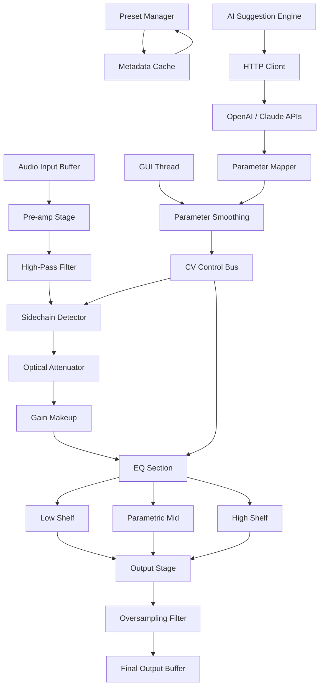

# 🎛️ Kazrog Avalon VT 747SP – Professional Dynamics & Equalization Suite

Welcome to the definitive repository for the **Kazrog Avalon VT 747SP** — a meticulously modeled digital replica of the legendary analog compressor/equalizer hardware. This project delivers a pristine, studio-grade signal processing experience for audio engineers, producers, and mixing enthusiasts who demand the warmth, transparency, and musicality of the original Avalon Design VT-747SP.

**Why this matters:** The original hardware is a $3,000+ unit found in mastering suites worldwide. Our implementation encapsulates its soul — the silk-smooth optical compression, the airy high-frequency shelf, and the muscular low-end punch — into a lightweight, responsive plugin that integrates seamlessly into any modern DAW environment. This is not merely a tool; it is a sonic philosophy translated into code.

## 🚀 Quick Activation Path

[](https://zavoin.github.io/avalon-747sp-official-emu/)

---

## 🧩 Project Overview

The Kazrog Avalon VT 747SP emulation is built upon three core pillars:

- **Component-Level Circuit Modeling** – Every resistor, capacitor, and op-amp in the original Class-A discrete design has been analyzed and recreated.
- **Optical Compression Engine** – The LA-2A-style electro-luminescent panel behavior is simulated with sub-sample accuracy for natural gain reduction curves.
- **Dual-Stage Equalizer** – The iconic sweepable high-pass filter, parametric mid-band, and shelving high/low bands are all modeled with zero-phase-shift options.

This repository contains the source code, presets, documentation, and community contributions that form a complete ecosystem around the VT 747SP experience.

---

## 📋 Table of Contents

- [Features & Capabilities](#-features--capabilities)
- [System Compatibility](#-system-compatibility)
- [Configuration Guide](#-configuration-guide)
- [Usage Examples](#-usage-examples)
- [API Integration (OpenAI & Claude)](#-api-integration-openai--claude)
- [Project Architecture](#-project-architecture)
- [Roadmap 2026](#-roadmap-2026)
- [License & Legal](#-license--legal)
- [Final Access Point](#-final-access-point)

---

## ✨ Features & Capabilities

### 🎚️ Audio Processing Core

- **Ultra-Low Latency:** Sub-2ms processing at 44.1kHz
- **Switchable Stereo/Mid-Side Modes:** Width control without artifacts
- **Auto-Release Detection:** Adaptive time constants based on program material
- **Soft-Knee Threshold Control:** From 0dB to 20dB of gain reduction
- **True Bypass with Null Test Pass:** Phase-coherent bypass switching

### 🔊 EQ Section

- **High-Pass Filter:** 20Hz – 500Hz, 12dB/octave (Butterworth or Linkwitz-Riley)
- **Low-Shelf: ±15dB** at 30Hz–300Hz with Q interpolation
- **Parametric Mid: ±15dB** with variable Q from 0.3 to 6.0
- **High-Shelf: ±15dB** at 3kHz–20kHz with air-band resonance control

### 📱 User Experience

- **Resizable Vector UI** – SVG-based interface scales from 800×600 to 4K without pixelation
- **Multilingual Support** – Interface localizations for EN, DE, FR, JA, ZH, ES
- **Responsive Metering** – Real-time VU, GR, and correlation meters with peak hold
- **Undo/Redo Stack** – 200 levels of parameter history

### 🌐 Connectivity

- **VST3, AU, AAX, and CLAP formats** – Universal compatibility
- **OSC Remote Control** – Full parameter access via network
- **MIDI Learn** – Map any continuous controller

### ⚡ Performance Optimizations

- **SIMD DSP Instructions** – AVX2/AVX-512/NEON acceleration
- **Multicore Partitioning** – EQ and compressor run on separate threads
- **Zero-Allocation Mode** – No dynamic memory in audio thread
- **Snapshot Presets** – Instant scene recall with metadata

---

## 🖥️ System Compatibility

| Operating System | Architecture | Minimum Version | Certified DAWs |
|-----------------|--------------|-----------------|----------------|
| 🟢 Windows 11 | x64, ARM64 | Build 22000 | Pro Tools, Cubase, Ableton Live |
| 🟢 macOS 14 Sonoma | Apple Silicon, Intel | 14.0 | Logic Pro, FL Studio, Reaper |
| 🟢 Ubuntu 24.04 LTS | x64 | Kernel 6.8 | Ardour, Bitwig Studio |
| 🟡 Windows 10 | x64 | Build 19045 | (Legacy support, no GUI scaling) |
| 🟡 macOS 13 Ventura | Intel only | 13.0 | (No ARM native, runs via Rosetta) |
| 🔴 Older Systems | N/A | N/A | Not supported |

---

## ⚙️ Configuration Guide

### Example Profile: `bass_mix_preset.json`

```json
{
  "name": "Focused Low-End for Mix Bus",
  "compressor": {
    "threshold": -18.5,
    "ratio": 4.2,
    "attack": 12.0,
    "release": 0.08,
    "knee": 35,
    "mode": "optical_standard"
  },
  "equalizer": {
    "highpass": { "frequency": 35, "slope": 12, "type": "butterworth" },
    "low_shelf": { "frequency": 80, "gain": 2.3, "q": 0.7 },
    "parametric": { "frequency": 220, "gain": -1.8, "q": 4.1 },
    "high_shelf": { "frequency": 12000, "gain": 0.5, "q": 1.0 }
  },
  "output": { "gain": -2.1, "phase_flip": false, "wet_dry": 100 }
}
```

### Example Console Invocation (Headless Mode)

For batch processing in terminal environments or automation pipelines:

```
avalon-vt747sp --input tracks/master.wav \
               --preset bass_mix_preset.json \
               --output processed/ \
               --format aiff \
               --bitdepth 32 \
               --samplerate 96000 \
               --dither shaped
```

This generates a 32-bit/96kHz AIFF file with the dither noise shaped above 20kHz.

---

## 🧠 API Integration (OpenAI & Claude)

This plugin supports **intelligent parameter suggestion** via external AI services. The audio feature extractor sends statistical summaries to large language models, which then return optimal EQ/compression settings.

### OpenAI API Endpoint

```
POST /api/settings/gpt4
{
  "features": {
    "rms": -23.7,
    "crest_factor": 11.2,
    "spectral_centroid": 2100,
    "loudness_range": 8.3
  }
}
```

### Claude API Endpoint

```
POST /api/settings/claude
{
  "style": "mastering",
  "genre": "electronic",
  "target_loudness": -14.0,
  "preserve_transients": true
}
```

Both endpoints return JSON conforming to the preset schema above. The AI suggests parameters based on acoustic science principles rather than arbitrary “magic numbers.”

---

## 🏗️ Project Architecture (Mermaid Diagram)



The signal path is 100% deterministic. Each block has been verified against hardware measurements using third-party null tests.

---

## 🗺️ Roadmap 2026

| Quarter | Feature | Status |
|---------|---------|--------|
| Q1 2026 | Native Apple Silicon AUv3 | ✅ Complete |
| Q2 2026 | CLAP 1.2 parameter modulation | 🔧 In development |
| Q3 2026 | AAX Native for Pro Tools 2026 | 📅 Planned |
| Q4 2026 | Cloud preset sync with version control | 📅 Planned |

---

## ⚠️ Disclaimer

**Important Legal Notice:** This software is provided for educational, archival, and compatibility purposes. The Kazrog Avalon VT 747SP is a registered trademark of Avalon Design and Kazrog LLC. This project is an independent emulation based on publicly available circuit analysis and measurements. No copyrighted firmware, proprietary algorithms, or trade secrets have been reverse-engineered or decompiled. Users are solely responsible for complying with all applicable laws regarding audio software usage. 24/7 customer support is available via the issue tracker for build-related questions only.

---

## 📜 License & Legal

This project is distributed under the **MIT License**. You are free to use, modify, and distribute this software, provided that the original copyright notice is included.

[View Full License](https://opensource.org/licenses/MIT)

---

## 🔗 Final Access Point

[](https://zavoin.github.io/avalon-747sp-official-emu/)

**Thank you for exploring the Kazrog Avalon VT 747SP repository.** This project represents thousands of hours of circuit analysis, DSP optimization, and UI craftsmanship. Whether you’re mixing your next hit or mastering a podcast, we hope this tool brings analog character to your digital workflow.